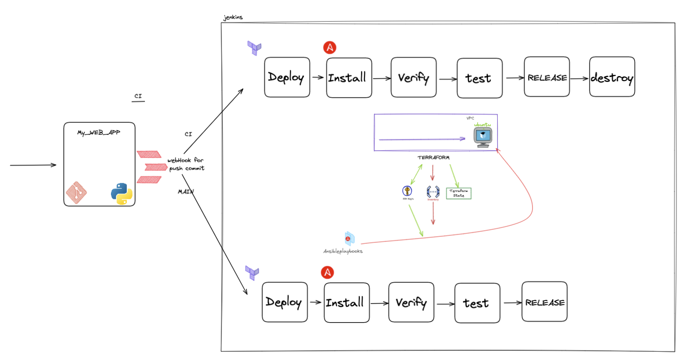

# Versatile
DevOps Engineer Home Challenge for @Versatile

- [Project purpose and architecture](#architecture)
- [Technologies used](#actions)
- [Deployment ](#projects)
- [The tests ](#tests)
- [How to use](#scopes)
- [Future](#scopes)

# Project purpose
DevOps Engineer Home Challenge for @Versatile
As part of this Home assignment, I was required to create a web-app that returns Hello,<name> , deploy it automatically, test and create useful CI flow.

important notes:
1. Engineers cannot deploy to same enviorment  
This was done by using GIT to manage my Terraform code. It allows me to track changes to your code and manage conflicts one build at a time.
2. Links can be seen throughout the Jenkins jobs run  
2.1 deployed web app 
2.2 docker image 
3. Emails on failed test 

# Architecture

 
Versatile web app  CICD flow involves the following stages:   

1. `Deploy`  
In this stage, we deploy an EC2 instance to aws, using terraform aws module 
2. `verify` 
In this stage, we verify that the EC2 instance was created succesfully 
3. `Install`  
In this stage, we install our web application on top of the EC2 using ansible whcih runs docker-compose to initiate a docker container that holds our web app  
4. `Test`  
In this stage, we test the functionality of the web-app  
such as:  
    4.1 Health Checks
    4.2 Health Checks
    4.3 Health Checks
5. `Release`  
In this stage, we release the image as artifact to dockerhub.  
This image containes the latest of our code
6. `Destroy` 
On development pipelines only (pipelines that came from any other branch but `main`)
it will kill the EC2 machine that was created during the pipeline

# Deployment
## Development deployment:  

# The tests

# How to use

# Artifacts

# Future work
1. enable terraform variables to choose from a drop down list, just to not always use the free tier
2. make production web-app always on and re-deploy with flag
3. fix folder structure to better visibility (ansible files, TF files, Docker files)
4. add proxy such as NginX

